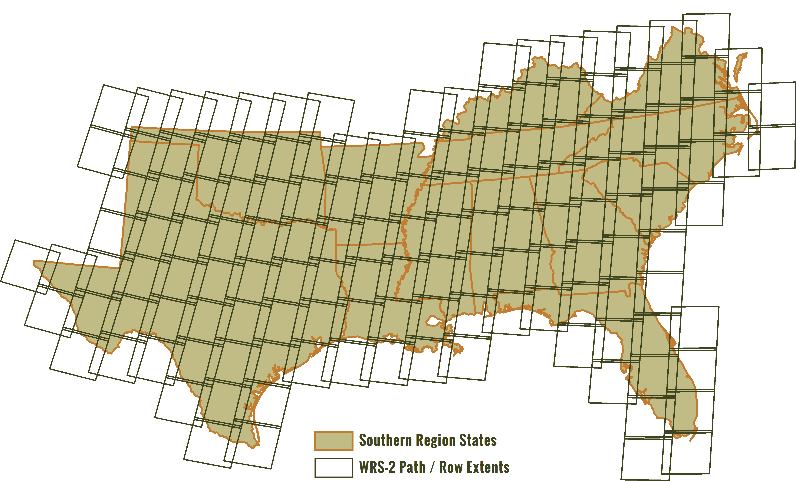

# Background

Forests of the South are constantly changing. Numerous projects completed and ongoing have identified, quantified or otherwise documented these changes at varying scales, frequencies, and durations. Some of these projects include:
* [Southern Forest Resource Assessment](http://www.srs.fs.usda.gov/sustain/)
* [Southern Forest Land Assessment](http://tfsweb.tamu.edu/main/popup.aspx?id=5818)
* [Southern Forest Futures Project](http://www.srs.fs.usda.gov/futures/)
* [Forest Inventory and Analysis National Program](http://www.fia.fs.fed.us/)
* [ForWarn](http://forwarn.forestthreats.org/)
* [Forest Health Protection Mapping and Reporting](http://foresthealth.fs.usda.gov/portal)

The Southern Forest Futures Project forecasted that up to 22 million acres of forestland in the South will be lost to other land uses over the next 50 years. Changes to forest cover due to wildfire, prescribed fire, forest pests, non-native invasive plants, natural disasters, climate, harvesting, and conversion to other uses (e.g., urban, agriculture, etc.) greatly influence the Southern landscape. Timely information that helps identify where these changes are occurring is critically important to sustain short- and long-term efforts to manage, conserve, enhance, and restore forestland in the South.

Remote sensing and Geographic Information System (GIS) technologies are more frequently being used to assist with a variety of projects ranging from wildfire, disaster, and pest damage assessments to the identification of forest operations for Best Management Practices (BMP) monitoring. Utilizing a variety of satellite analysis methods, Landsat satellite imagery, and supplemental data, the Southern Forest Area Change Tools (SouthFACT) project is working to develop a web-based forest change detection system capable of near real-time analysis of imagery and distribution of simple-to-use products as frequently as biweekly.

# Project Purpose
The primary purpose of the SouthFACT project is to support efforts to identify and quantify changes in forest cover as they occur across the Southern landscape and to provide the information to state forestry agencies and partners in a way that helps sustain efficient and effective program delivery, including:
* **Responding to natural hazards (e.g., wildfire, hurricanes, tornadoes, ice damage)**
* **Assessing damage to forests following natural hazards**
* **Reviewing and advising landowners harvesting timber**
* **Assisting landowners and resource professionals with reforestation**
* **Identifying and responding to forest health threats**

# Project Area
The initial phase of the SouthFACT project includes the 13 Southern states, encompassing 142 World Reference System (WRS) – 2 path / row areas that intersect one or more of these states.

# Funding and Project Participants
The SouthFACT project is made possible through the collaborative efforts of state forestry agencies in the South, with funding support from the U.S. Forest Service Southern Region (Region 8). Southern state forestry agencies were awarded a 2014 competitive Redesign grant under the Cooperative Forestry Assistance Act to complete the project. The N.C. Forest Service is serving as the lead state responsible for facilitating the development of the applications through the Southern Group of State Foresters (SGSF).

The University of North Carolina at Asheville’s National Environmental Modeling and Analysis Center (NEMAC) is supporting the development of the SouthFACT website and applications. The guidance and collaboration of the U.S. Geological Survey (USGS) Earth Resources Observation Systems (EROS) Data Center (EDC) has been and will continue to be critical throughout the project.